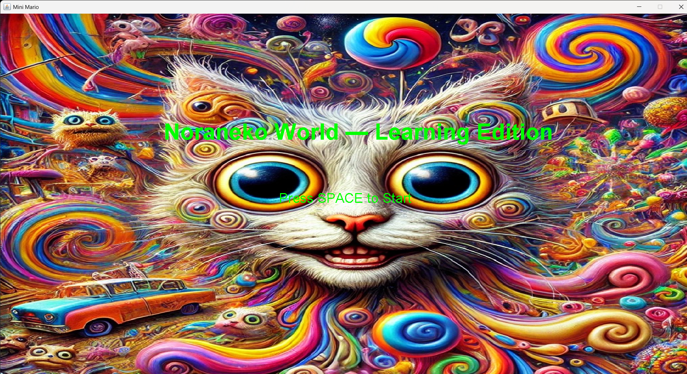
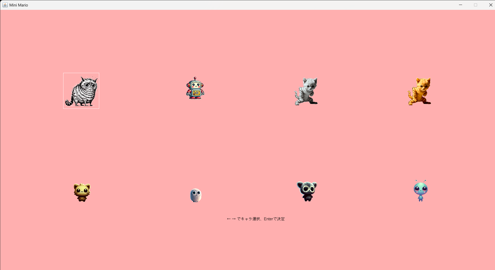
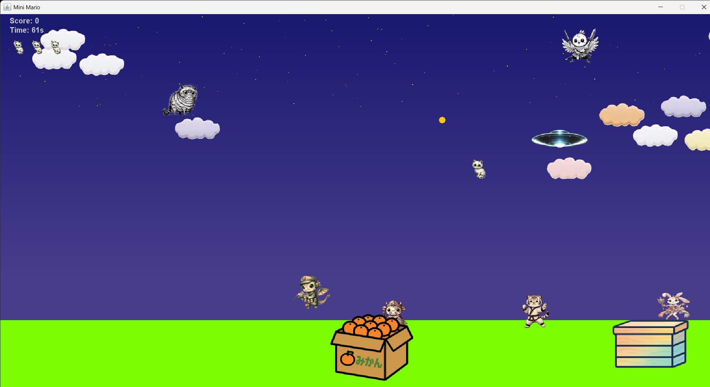

# java-platformer# Java Platformer Game (マリオ系横スクロールアクション)

                
---

## プロジェクト概要
このプロジェクトは、Javaの **Swing** を使用して開発した横スクロール型アクションゲームです。  
マリオ系の操作感を意識し、フリー素材と自作素材を組み合わせています。  
JavaのGUIプログラミングやオブジェクト指向の理解を深める目的で作成しました。

- 開発言語：Java  
- GUI：Swing  
- 使用素材：フリー素材 + 自作素材  
- クラス数：現在11個（今後2000行を超える神クラスを分割予定）  
- ゲームジャンル：横スクロールアクション  

---

## 技術ポイント

### 1. オブジェクト指向設計
- 初期段階では神クラスで作成していましたが、徐々に **クラス分割・役割分離** を行い、保守性・拡張性を意識  
- キャラクター設定画面、敵ボスキャラなどを個別クラス化  

### 2. SwingによるGUI実装
- `JPanel` と `JFrame` を用いた描画  
- `KeyListener` によるプレイヤー操作  
- アニメーションやスクロール制御の実装  

### 3. ゲーム構造
- メインループで描画とゲームロジックを制御  
- 衝突判定やアイテム取得処理をオブジェクト単位で管理  
- 将来的に大規模化に対応可能な設計を目指し改善中  

---

## プロジェクト構成

java-platformer/
├─ src/ # Javaコード
├─ images/ # ゲームスクショ
├─ README.md
└─ .gitignore

---

## 動画デモ
プレイ画面の動画は YouTube で限定公開しています：

[動画を再生する](https://youtu.be/yyndoHVYtW4)

---

## 今後の改善・学習ポイント
- 神クラス化してしまった2000行規模のクラスを、より **小さな責務ごとのクラスに分割**  
- ゲームの拡張（ステージ追加、敵の種類増加）  
- Java Swing 以外の描画・アニメーション技術の習得  

---

## まとめ
- JavaでGUIとゲームロジックを統合した **初めての本格的なプロジェクト**  
- クラス分割やオブジェクト指向設計を通じて、**設計力・実装力・改善力** をアピール可能  
- GitHubリポジトリを通じて、コードや進行中の改善も確認できます  

